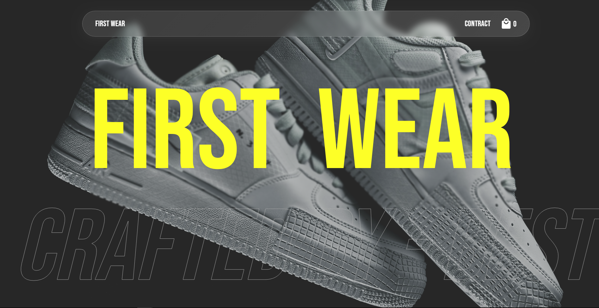
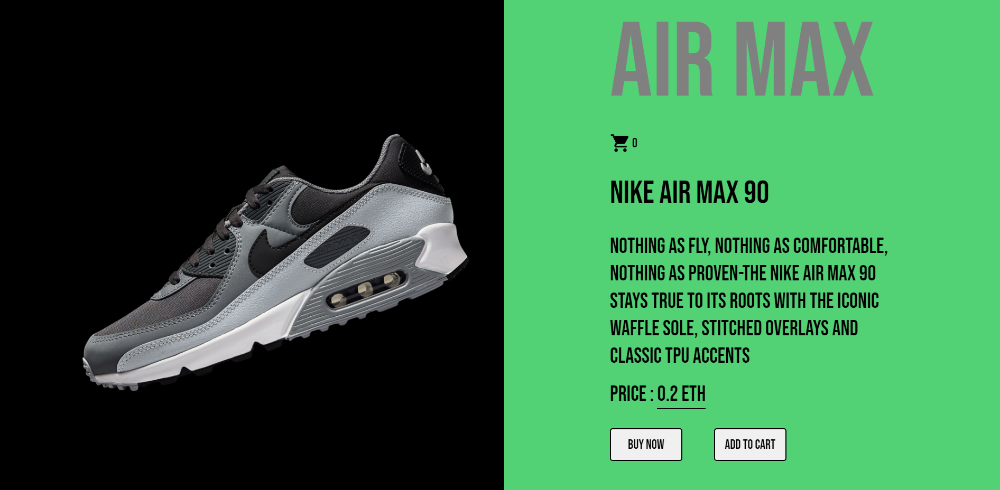

#Buy shoes using crypto...FirstWear E-commerce website.

Demo of the website : https://first-wear.netlify.app/

ScreenShots of the website: 







## Installation

If you are cloning the project then run this first

```sh
git clone https://github.com/Aradhya1905/First-Wear.git
```

Make sure you have node.js installed ,then run "npm install"

```sh
npm install
```

## Usage

For Dev server run command

```sh
npm run dev
```

For Production run 

```sh
npm run build
```

Smart contract is deployed to Polygon Testnet network.


